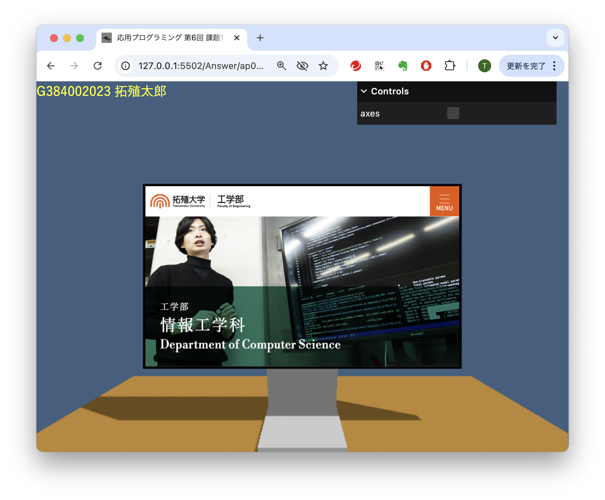
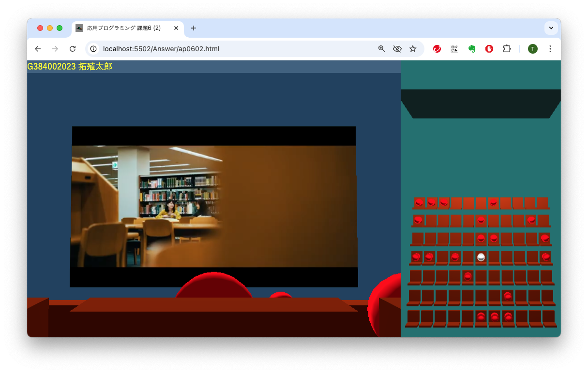

# 応用プログラミング 第7回

## 課題1

1) 初期コードの 各ファイルに記述されている氏名と学生番号を自分のものに変更せよ．

1) 資料に従ってプログラムを変更して，次の図と同じような出力が得られるようにせよ．

1) 変更したプログラムを commit 及び push して，GitHub上のリポジトリを更新せよ．

## 課題2

1) 初期コードの 各ファイルに記述されている氏名と学生番号を自分のものに変更せよ．

1) 資料に従ってプログラムを変更して，次の図と同じような出力が得られるようにせよ．

1) 変更したプログラムを commit 及び push して，GitHub上のリポジトリを更新せよ．

1) 教員またはSAの確認を受けること
